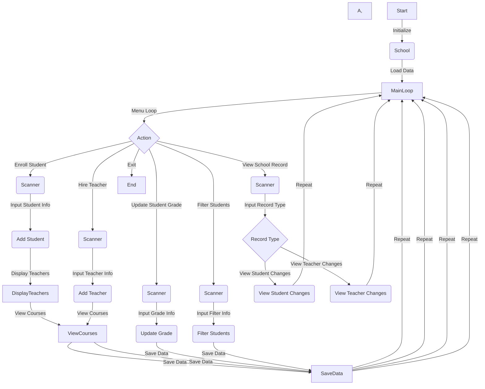

## School Management System

This is a simple School Management System implemented in Python. The system allows users to manage students, teachers, and school records. Here's an overview of the main features:

### Classes

1. **Teacher:**
   - Represents a teacher with a name and a map to store students and their grades by course.
   - Methods:
     - `update_student_grade(student_name, course_id, grade)`: Update a student's grade.
     - `filter_students_by_grade_and_course(grade, course_id)`: Filter students by grade and course.

2. **Student:**
   - Represents a student with a name and a map to store grades by course.
   - Methods:
     - `view_grades()`: View grades for the student.
     - `view_teacher_by_course_id(course_id, teacher)`: View teacher for a specific course.

3. **SchoolRecord:**
   - Represents the school record with lists to store student and teacher record changes.
   - Methods:
     - `add_student_change(change)`: Add a change to the school record for students.
     - `add_teacher_change(change)`: Add a change to the school record for teachers.
     - `view_student_changes()`: View all changes in the school record for students.
     - `view_teacher_changes()`: View all changes in the school record for teachers.

4. **School:**
   - Represents the school with lists to store students, teachers, and a school record.
   - Methods:
     - `enroll_student()`: Enroll a new student.
     - `hire_teacher()`: Hire a new teacher.
     - `update_student_grade()`: Update a student's grade.
     - `filter_students_by_grade_and_course()`: Filter students by grade and course.
     - `view_school_record()`: View the school record.
     - `display_available_courses_with_numbers()`: Display the available courses with numbers.
     - `save_data()`: Save data to a file.
     - `load_data()`: Load data from a file.
     - `get_teachers_for_course(course_id)`: Get teachers for a specific course.
     - `get_selected_courses(course_numbers)`: Get selected courses based on course numbers.
     - `get_updated_grade(grade_option)`: Get updated grade based on grade option.

### Usage

1. Run the program, and a menu will prompt you to choose an action.
2. Actions include enrolling a student, hiring a teacher, updating student grades, filtering students, viewing school records, and exiting the program.
3. The system allows you to perform various tasks related to school management.

### Data Persistence

- The system saves and loads data from a file (`school_data.pkl`) to maintain the state of students, teachers, and the school record between program runs.

I really tried and worked hard on this code, Thank you!

### Flowchart
![Link Name][(https://pasteboard.co/i2X921pJxrkV.png)  

